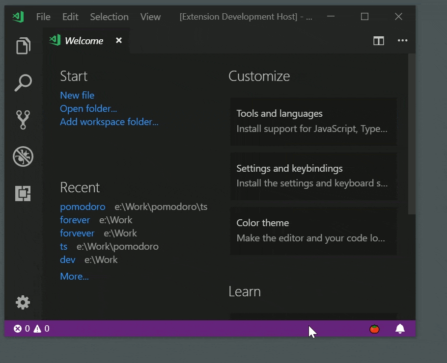

# Pomodoro

This was fun. My first VSCode extension and Git repository. This is my version of [Pomodoro Technique](https://en.wikipedia.org/wiki/Pomodoro_Technique) as extension for VSCode. Hope you like it.

## Features

Breaks down work into intervals (pomodoros) of 25 minutes separated by short breaks of 5 minutes, 4 pomodoros (sets) are separated by long breaks of 15 minutes. 

After you start Pomodoro (Command Palette: Pomodoro Start/Pause) you will have in statusbar `🍅 Work 1/1 25:00`:
* `🍅` : the unicode character for tomato
* `Work` : you are in the middle of a pomodoro
* `1/1` : pomodoro 1 in set 1
* `25:00` : the timer, after a second will become 24:59 and so on...

Above are the defaults that can be changed from settings.

The extension creates items in:
* Command Palette: Pomodoro Start/Pause and Pomodoro Reset
* Statusbar (and its tooltip): with custom texts from settings
* Notifications: with custom texts from settings
* Settings: Available settings bellow

## Extension Settings

This extension contributes the following settings:

* `pomodoro.work` : time of a pomodoro
* `pomodoro.break` : time of break between pomodoros
* `pomodoro.repeat` : how many pomodoros in a set
* `pomodoro.longBreak` : time of break between sets
* `pomodoro.autoStart` : auto start on VSCode startup
* `pomodoro.filePath` : send changed state `{ repeat: number, task: number, set: number, is: string, active: string }` to your file `module.exports = state => console.log(state)`
* `pomodoro.make.notification` : display notifications
* `pomodoro.make.statusbar:{alignment;priority}` : create a statusbar item
* `pomodoro.texts:{notification;statusbar;tooltip}` : the texts displayed, available placeholders with their outputs (you can see in the default values how they work):
  * `%work{Work}` : Work
  * `%break{Break}` : Break
  * `%repeat` : 4 
  * `%longBreak{Long Break}` : Long Break
  * `%started{Started}` : Started
  * `%paused{Paused}` : Paused
  * `%reset{Reset}` : Reset
  * `%task` : 1,2,3,4,1,2...
  * `%tasksLeft` : 4,3,2,1,4,3...
  * `%set` : 1,2,3,4,5,6...
  * `%hour` : 01,00,23,22...
  * `%minute` : 01,00,59,58...
  * `%second` : 01,00,59,58...

## Release Notes

### 1.0.0

Initial release

### 1.1.0

Remember the state when opening a folder, reloading a window, etc

-----------------------------------------------------------------------------------------------------------

[Buy me a Coke](https://www.paypal.com/cgi-bin/webscr?cmd=_s-xclick&hosted_button_id=JCKTBQ6RWCBBA)

**Enjoy!**
